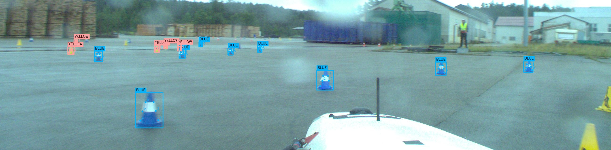
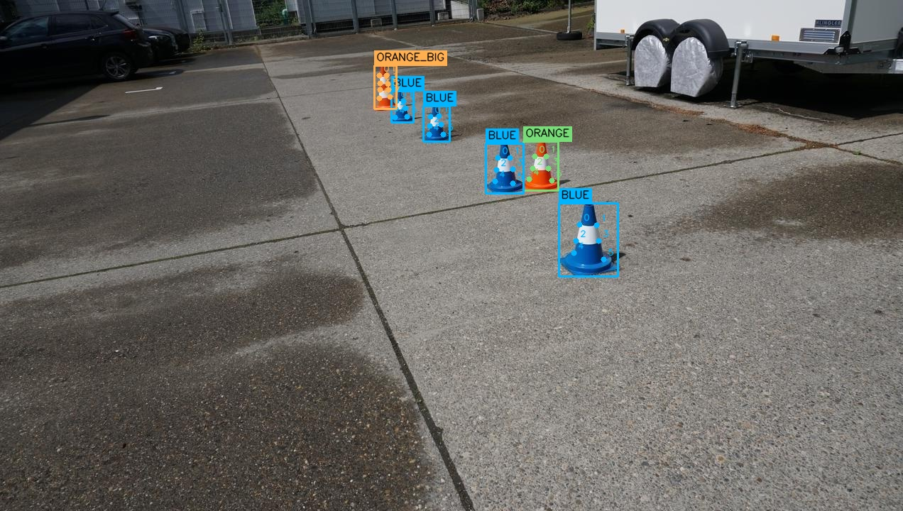
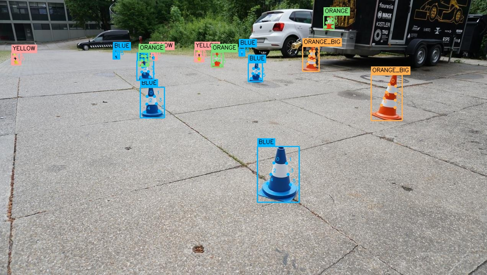
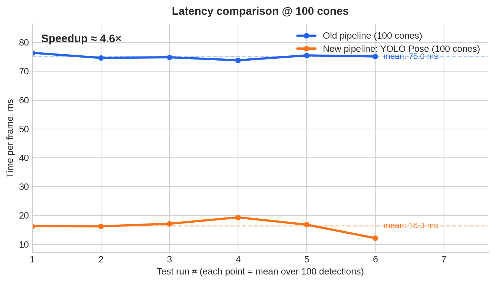

# BRT Cone Pose Dataset

A FSOCO-like dataset for **Formula Student Driverless** cone localization (BBoxes + Classes + Keypoints) in a **single annotation format**:
- **Bounding Boxes**
- **Cone types/classes** (blue / yellow / orange / big orange / unknown)
- **Keypoints (pose)**

[Download Dataset](https://drive.google.com/file/d/1auin-vVcP3dQMW-wuloVYWxoqvQshGWk/view?usp=share_link)

This dataset was created within the **Bauman Racing Team Driverless** perception workstream.

> If you use this dataset in research, projects, or products, please **credit Bauman Racing Team (BRT)**.
> See the **Citation** section.

---

## Dataset structure & format

```text
fsoco-pose-split
├── data.yaml
├── images
│   ├── test
│   ├── train
│   └── val
└── labels
    ├── test
    ├── train
    └── val
```

This is the standard **YOLO-Pose** dataset format. Each image has its own label file in the `labels/` directory.

---

## Dataset stats

File counts (images + label files):
- **train:** 2209
- **test:** 278
- **val:** 277

Total: **2764** samples.

---

## Annotated examples





---

## Why we made this dataset

Traditional FS Driverless pipelines (e.g. Detection -> Pose estimation -> Localization) are not efficient enough,
especially when compared with one-step pose estimators.

By using this type of models, we managed to get almost **5x boost in speed** (with **100 cones per image**
detection cap).



---

## Benchmark: ~5x speed boost (details)

We achieved ~**5x end-to-end speedup** using a one-stage pose estimator compared to a traditional multi-stage pipeline.

**Benchmark setup:**
- Engine: **TensorRT**
- GPU: **NVIDIA RTX A2000**
- Model: `yolo26n-pose.pt`
- Input size: `imgsz=800`
- Metric: **end-to-end (E2E)** latency (= pre + inference + post)
- Limit: **max 100 detected cones per frame** (= we cap detections to 100 cones per image for consistent runtime)

> The plotted line shows the E2E runtime behavior under this 100-cone cap.

---

## Keypoints spec (YOLO-Pose)

This dataset uses **YOLO-Pose** labels: each object = `class + bbox + keypoints`.

### Label line format

Each line in a label file (one per image) follows:

`<class_id> <x_center> <y_center> <width> <height> <kpt0_x> <kpt0_y> <kpt0_v> ... <kpt7_x> <kpt7_y> <kpt7_v>`

- Bounding box values are **normalized** to [0..1] relative to image width/height.
- Keypoints are stored as triples (`x`, `y`, `v`) and are also **normalized** to [0..1].
- `kpt_shape: [8, 3]` means **8 keypoints** with **3 values each**.
- Real number of keypoints: **8 for big cones** and **6 for small cones** **(last 2 keypoints coordinates are zeroed)**.


---

## Quick start (Ultralytics YOLO-Pose)

### 1) Install Ultralytics

Make sure you have a **compatible Ultralytics version** for YOLO-Pose training/inference.

Example:

`pip install -U ultralytics`

### 2) Train

Use `data.yaml` from this dataset and any YOLO-Pose checkpoint.

Example with our checkpoint name:

```python
from ultralytics import YOLO


model = YOLO("yolo26n-pose.pt")
results = model.train(
  data="fsoco-pose-split/data.yaml",
  epochs=100,
  batch=32,
  device=0
)
```

---

## License & Data Provenance

### Image data (FSOCO)

The **images used in this dataset originate from the FSOCO (Formula Student Objects in Context) dataset**.

All rights, ownership, and licensing of the **raw images** belong to the original FSOCO authors and contributors.
This repository **does not claim ownership** over the images and **does not redistribute them independently of FSOCO**.

The images are included **only as part of the original FSOCO dataset structure** and remain subject to the
**FSOCO terms of use and licensing conditions**.

If you use or redistribute the images, you must comply with the official FSOCO license and usage rules:
FSOCO website: https://fsoco.github.io/fsoco-dataset/

---

### Annotations and derived data (this repository)

The **annotations provided in this repository** (bounding boxes, cone classes, and keypoints / pose labels) are
**derived annotations** created within the **Bauman Racing Team (BRT) Driverless perception pipeline**.

Unless stated otherwise:
- **Annotations and scripts** in this repository are released under the **CC BY 4.0** license.
- You are free to **use, modify, and redistribute** the annotations for research or commercial purposes, provided that proper attribution is given.

**Attribution requirement**:
> Any use of these annotations must include a reference to **Bauman Racing Team (BRT)** and this repository.

---

## Notes on licensing split

To avoid ambiguity, we separate licensing for **images** and **annotations**:

- **Images:** come from the original **FSOCO** dataset and remain under the **FSOCO terms**. This repository does **not** claim ownership over the images.

- **Annotations and scripts in this repository:** (`labels/*`, scripts, derived metadata) are released under **CC BY 4.0**. You may use/modify/redistribute them with attribution to **Bauman Racing Team (BRT)**.

If you redistribute this dataset, please ensure you:
1. Keep attribution to **FSOCO** for images, and follow **FSOCO terms**.
2. Keep attribution to **BRT** for derived annotations (CC BY 4.0).

---

## Citation

If you use this dataset (annotations and/or structure) in academic work, research, or published projects,
please cite **both**:

### This repository (annotations)

```bibtex
@misc{brt_cone_pose_annotations_2026,
  title        = {BRT Cone Pose Annotations for YOLO-Pose (derived from FSOCO)},
  author       = {{Bauman Racing Team}},
  year         = {2026},
  howpublished = {GitHub repository},
  note         = {Derived annotations (bboxes, classes, keypoints) for FSOCO images},
}
```

### The original FSOCO dataset

```bibtex
@inproceedings{vodisch2022fsoco,
  title     = {FSOCO: The Formula Student Objects in Context Dataset},
  author    = {V{\"o}disch, Nicolai and Dodel, Patrick and Sch{\"o}tz, Markus},
  booktitle = {IEEE Intelligent Vehicles Symposium (IV)},
  year      = {2022}
}
```

### Notes on fair use and attribution

This repository does not replace FSOCO and is intended to be used together with the original dataset.
Please do not remove or obscure references to FSOCO or Bauman Racing Team when using this data.
Derived annotations must not be presented as independently collected image data.

---

[Download Dataset](https://drive.google.com/file/d/1auin-vVcP3dQMW-wuloVYWxoqvQshGWk/view?usp=share_link)

[Bauman Racing Team](https://baumanracing.ru)
